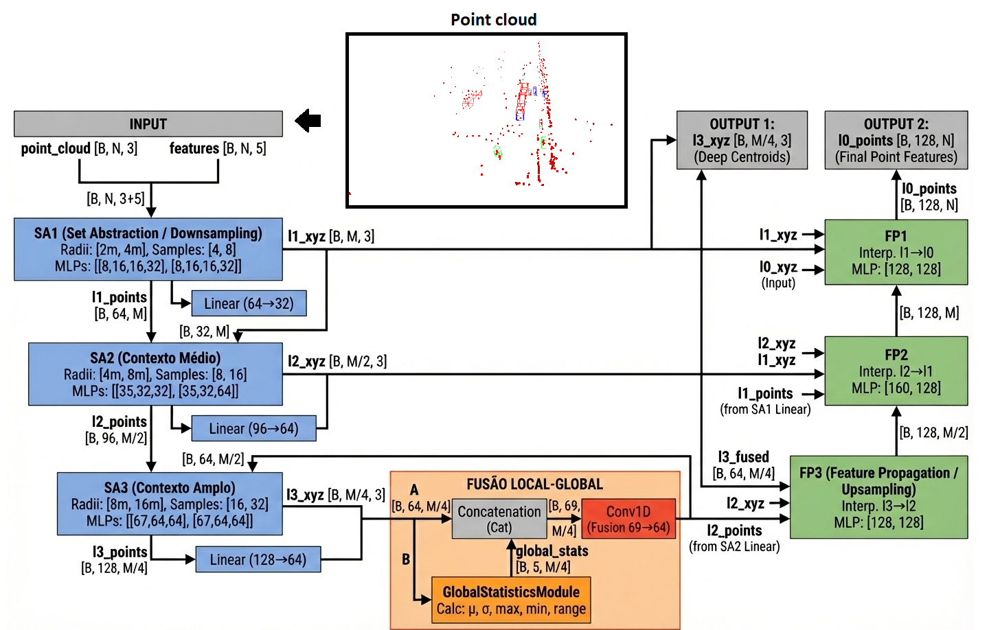
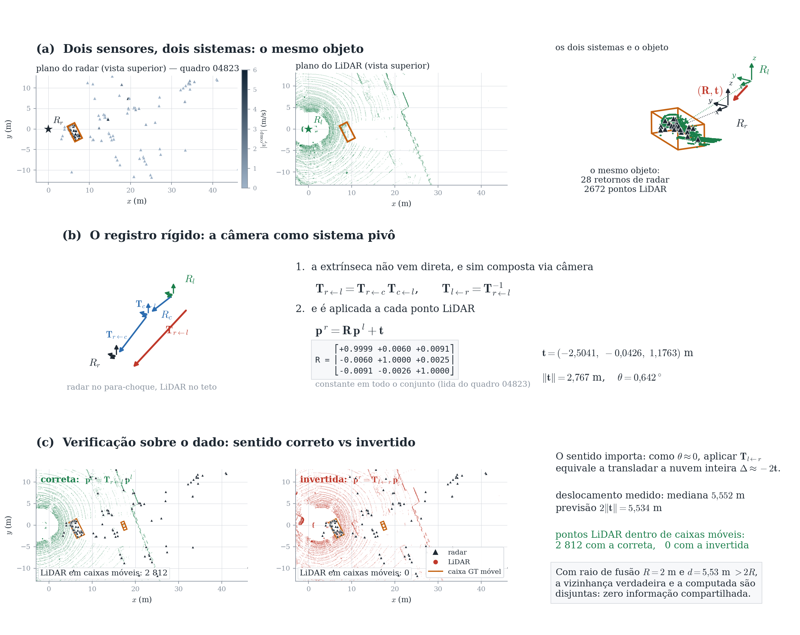
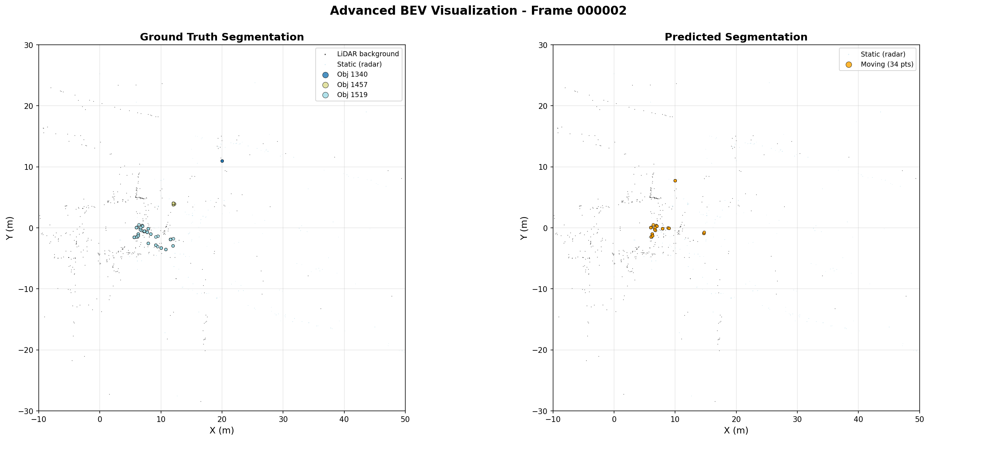
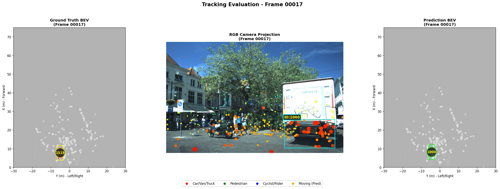

<div align="center">
  
</div>

<div align="center">

[](https://www.python.org/)
[](https://pytorch.org/)
[](./docker/Dockerfile)
[](./LICENSE)

📖 [Introduction](./docs/pages/introduction.md) | ⚙️ [Installation](./docs/pages/installation.md) | 🚀 [Get Started](#-getting-started) | 📘 [Documentation](./docs/pages/documentation.md) | 🛰️ [Maritime radar case study](./docs/pages/maritime_radar_case_study.md)

</div>

## Table of Contents

- [Prerequisites](#prerequisites)
- [Dataset](#dataset)
- [Environment Setup](#environment-setup)
- [Method](#method)
- [🚀 Getting Started](#-getting-started)
  - [Phase 1: Backbone Pre-training](#phase-1-backbone-pre-training)
  - [Phase 2: Tracking Model](#phase-2-tracking-model)
- [Evaluation](#evaluation)
- [Results](#results)
- [References](#references)

## Prerequisites

This project requires access to the View of Delft dataset and corresponding tracking annotations.

2D manual boxes to measure the reprojection error 4D to 2D: [](https://doi.org/10.5281/zenodo.18933010)

Weights: [](https://doi.org/10.5281/zenodo.22212989)
[Google Drive](https://drive.google.com/drive/folders/1ES5mvwTNd957d1wRxdbb_hcUX75J3KGs?usp=drive_link) — `seg_exp_Q_lidarflow/best_miou_model.pth` (Phase 1 backbone) and `reid_head.pth` (Phase 2 re-identification head). Access is restricted until the thesis is published.

## Dataset

### Required Data

1. **View of Delft Dataset**
   - Link: [tudelft-iv/view-of-delft-dataset](https://github.com/tudelft-iv/view-of-delft-dataset/tree/main)
   - Requires authorization from the authors

2. **Tracking Annotations**
   - Link: [RaTrack Annotations](https://github.com/LJacksonPan/RaTrack/tree/main)


### Expected Dataset Structure

```
view_of_delft_PUBLIC/
├── lidar/
│   ├── ImageSets/
│   ├── testing/
│   │   ├── calib/
│   │   ├── image_2/
│   │   ├── label_2_tracking/
│   │   ├── pose/
│   │   └── velodyne/
│   └── training/
│       ├── calib/
│       ├── image_2/
│       ├── label_2/
│       ├── label_2_tracking/
│       ├── pose/
│       └── velodyne/
├── radar/
│   ├── ImageSets/
│   ├── testing/
│   │   ├── calib/
│   │   ├── image_2/
│   │   ├── pose/
│   │   └── velodyne/
│   └── training/
│       ├── calib/
│       ├── image_2/
│       ├── label_2/
│       ├── pose/
│       └── velodyne/
├── radar_3frames/
│   └── ...
└── radar_5frames/
    └── ...
```

## Environment Setup

Build and run the Docker environment:

```bash
docker compose build
docker compose run
```

### GPU Considerations

When using PointNet with GPU acceleration, the library needs to be loaded and compiled for the specific GPU. This environment has been tested on:
- Personal machine with **RTX 3060**
- Cluster with dual **A100-PCIE-40GB**

**Note:** In multi-GPU scenarios, the environment does not properly utilize hybrid usage.

## Method

Our approach uses a local-global feature fusion backbone for multimodal 3D object tracking:



The architecture combines:
- **Local features**: Point-level representations from PointNet++
- **Global features**: Scene-level context from voxelized representations
- **Multimodal fusion**: Integration of LiDAR point clouds and camera images

### Radar–LiDAR registration

The radar sits on the bumper and the LiDAR on the roof, so the two clouds must be
brought into a common frame before any fusion. The extrinsic is composed through
the camera and applied to every LiDAR point.



## 🚀 Getting Started

### Phase 1: Backbone Pre-training

Pre-train the backbone using the segmentation configuration:

```bash
python train.py --config config/segmentation_phase1.yml
```

This will:
- Create logs in TXT format
- Save the best model checkpoint based on mIoU or F1-score at point level
- Optionally, use pre-trained weights (link provided in repository)

#### Evaluation and Visualization

To evaluate the trained model on the test set:
1. Point to the pre-trained weights in `config/segmentation_phase1.yml`
2. Enable `plot_segmentation` to generate inference visualizations

**Expected output:**



### Phase 2: Tracking Model

Train the tracking model with gallery-based re-identification:

```bash
python train.py --config config/reid_phase2.yml
```

Enable `plot_reid` to visualize results similar to the following:



*Left: Ground truth track IDs | Right: Predicted track IDs (vehicle class example)*

**Note:** This phase trains with perfect boxes and segmentation. During inference, the pre-trained model from Phase 1 is used.

### Optional detection sources

The tracker consumes detections from a pickle, so the box source is a plug-in
choice — `track_inference.py --detections <file>` accepts any of these and
**none of them is required by the main pipeline**:

| entry point | box comes from | notes |
|---|---|---|
| `precompute_detections_gtseg.py` | ground-truth box kept when the segmentation finds a moving radar point inside | upper bound; perfect localisation |
| `precompute_detections.py` | DBSCAN over the moving radar points, oriented box by PCA | the plain detector |
| `precompute_detections_dbscan_reid.py` | same, plus Doppler in the clustering, LiDAR-measured extent and pooled features for re-identification | see flags below |
| `precompute_detections_rgb.py` | 2D detector, LiDAR frustum lifted to 3D | Faster R-CNN, torchvision |
| `precompute_detections_yolo.py` | 2D detector matched against the annotated 2D boxes | needs `pip install ultralytics`, **not** in the base environment |

`precompute_detections_dbscan_reid.py` adds two switchable things over the plain
detector:

```bash
# Doppler as a third clustering dimension: two objects that touch in space but
# move differently no longer collapse into one cluster
--peso-doppler 0.5      # metres equivalent per m/s; 0 restores XY-only clustering

# extent and yaw from the dense LiDAR around the cluster, instead of a class prior
--sin-lidar             # restores the class prior
```

`precompute_detections_yolo.py` can merge its output with any other source that
emits ground-truth boxes, so the camera contributes what the radar misses:

```bash
--union-con tracker/results/detections_gtseg_val_mov_norider.pkl
```

## Evaluation

Run inference with the pre-trained segmentation model:

```bash
python eval.py --config config/eval_config.yaml
```

Pre-trained weights for both phases are available. Simply point to them in the configuration and run the evaluation script.

### Inference Demo


*Real-time tracking and segmentation inference on View of Delft test sequences*

## Results

Performance comparison on the View of Delft dataset:

| Configuration | mIoU | IoU moving | IoU static | Precision | Recall | F1 |
|---|---|---|---|---|---|---|
| LiDAR–Radar + MASG | **0.773** | **0.574** | **0.973** | **0.671** | 0.799 | **0.729** |
| Radar + MASG | 0.721 | 0.479 | 0.964 | 0.578 | 0.736 | 0.648 |
| LiDAR–Radar, no MASG | 0.741 | 0.518 | 0.965 | 0.578 | **0.834** | 0.683 |
| Radar, no MASG | 0.705 | 0.448 | 0.961 | 0.558 | 0.696 | 0.619 |

```bash
bash scripts/ablacao_fusao_segmentacao.sh
```

### Association cues (leave-one-out)

The matching cost combines five cues, renormalised to 1 by the tracker. Each row
zeroes one of them. Detections are the same for every row (GT box kept when the
segmentation finds a moving radar point inside), so the only thing that changes
is the association.

| Cue removed | sAMOTA | MOTA | IDSW |
|---|---|---|---|
| none (reference) | 76.50 | 72.44 | 119 |
| appearance | 76.47 | 72.09 | 126 |
| density | 76.65 | 72.19 | 119 |
| geometry | 76.22 | 72.16 | 179 |
| motion | 76.15 | 71.98 | 218 |
| spatial | 76.35 | 72.34 | 139 |

Motion is the cue that carries the association: removing it raises the identity
switches from 119 to 218, by far the largest effect. Geometry comes second (179).
Density is the least useful — removing it leaves the switches unchanged.

```bash
bash scripts/gerar_deteccoes_gtseg.sh      # detections used by the rows above
bash scripts/ablacao_pistas_rastreador.sh
```

### 3D box refresh rate

Upper bound of the tracker. Identity and per-point segmentation are the ground
truth and stay at 10 Hz (the native rate of View of Delft); only the 3D box
changes rate. On frames without a box the object does not disappear — it still
exists through the segmentation — and its box is rebuilt from the radar points
assigned to it.

| Box rate | Object displacement between updates | MOTA | HOTA | IDF1 | IDSW |
|---|---|---|---|---|---|
| 10 Hz (0.10 s) | 0.37 m (19% of its length) | 100.00 | 58.37 | 96.68 | 0 |
| 6.7 Hz (0.15 s) | 0.55 m (28%) | 53.97 | 46.28 | 71.09 | 13 |
| 5 Hz (0.20 s) | 0.73 m (37%) | 35.41 | 41.52 | 60.59 | 18 |

With a fresh box on every frame the tracker is exact — MOTA 100.00, zero identity
switches, every trajectory mostly tracked: it is not the bottleneck of the system.
Halving the box rate costs 65 points of MOTA while the identity switches stay in
double digits — what breaks is the geometry, not the association.

```bash
bash scripts/ablacao_taxa_caixa.sh
```

All scripts run inside the container:

```bash
docker compose -f docker/docker-compose.yml run --rm tracker_multimodal_mira \
    -lc "bash scripts/ablacao_taxa_caixa.sh"
```

### Field deployment: maritime surveillance radar

The annotation protocol was applied to a real-aperture maritime radar in
B-scope, with several optical cameras as context. A YOLOv8 detector trained on
3804 annotated radar frames reaches:

| mAP@50 | mAP@75 | mAP@50-95 | mAP medium | mAP small |
|---|---|---|---|---|
| **0.81** | 0.64 | 0.54 | 0.64 | 0.49 |

The gap between medium and small targets is the whole story of the deployment:
below roughly 25x32 pixels, clutter and vessel become visually indistinguishable
to the annotator and to the model alike. The detector's most useful property is
that it stays silent rather than firing on terrain or noise.

**[Read the full case study →](./docs/pages/maritime_radar_case_study.md)** —
annotation workflow, sensor pairing by timestamp, the difficulties the
annotators reported, and the training setup.

## References

This repository contains basic elements for evaluating metrics and loading data, adapted from:

- [AB3DMOT](https://github.com/xinshuoweng/AB3DMOT)
- [RaTrack](https://github.com/LJacksonPan/RaTrack)
- [View of Delft Dataset](https://github.com/tudelft-iv/view-of-delft-dataset)

### BibTeX Citations

```bibtex
@inproceedings{weng2020_ab3dmot,
  title     = {AB3DMOT: A Baseline for 3D Multi-Object Tracking and New Evaluation Metrics},
  author    = {Weng, Xinshuo and Wang, Jianren and Held, David and Kitani, Kris},
  booktitle = {European Conference on Computer Vision (ECCV)},
  year      = {2020}
}

@article{pan2024ratrack,
  title   = {RaTrack: Moving Object Detection and Tracking with 4D Radar Point Cloud},
  author  = {Pan, Liang and Liu, Zhihao and Thompson, Simon and others},
  journal = {IEEE Robotics and Automation Letters},
  year    = {2024}
}

@inproceedings{palffy2022vod,
  title     = {Multi-Class Road User Detection with 3+1D Radar in the View-of-Delft Dataset},
  author    = {Palffy, Andras and Dong, Jiaao and Kooij, Julian F. P. and Gavrila, Dariu M.},
  booktitle = {IEEE Robotics and Automation Letters},
  volume    = {7},
  number    = {2},
  pages     = {4961--4968},
  year      = {2022}
}
```

---

<div align="center">
</div>
