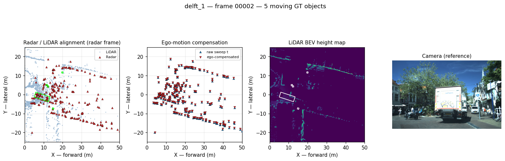
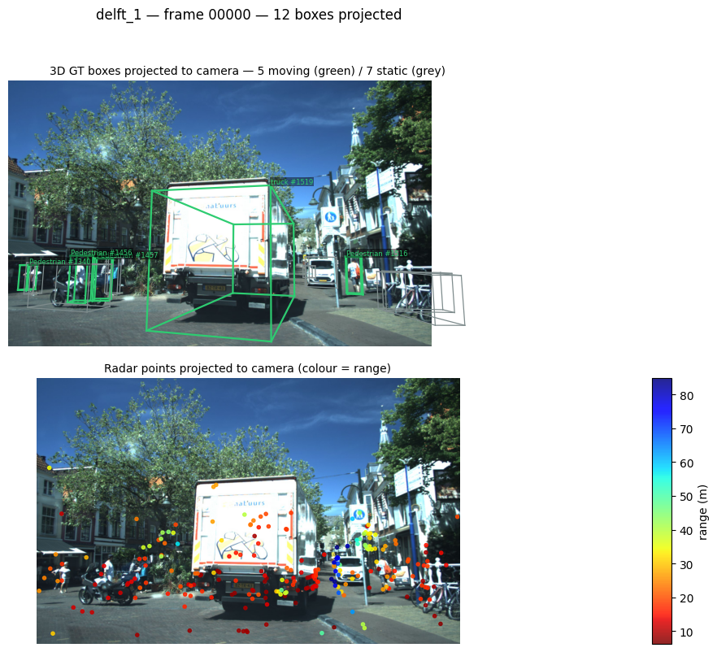

# Documentation

- [Dataloader sanity check](#dataloader-sanity-check)
- [Camera projection check](#camera-projection-check)
- [How the tracking metrics are computed](#how-the-tracking-metrics-are-computed)

## Dataloader sanity check

`examples/dataloader/check_dataloader.py` renders one figure per frame across the
train and validation splits, so the geometry the network will consume can be
inspected before training. Each figure has four panels:

| Panel | What it verifies |
|---|---|
| **Radar / LiDAR alignment (BEV)** | the extrinsic transform. Both modalities must land on the same structures; a constant offset means the calibration is wrong |
| **Ego-motion compensation (BEV)** | `T_ego`. Static structure must collapse onto itself between the raw and compensated sweep; residual drift means the pose chain is wrong |
| **LiDAR BEV height map** | the top-down rasterisation used downstream |
| **Camera** | RGB reference for the same frame |

Ground-truth moving boxes are overlaid on the BEV panels.



*`delft_1`, frame 00002. Radar (red) follows the same street-canyon walls as the
LiDAR (blue) at ±15–20 m lateral, confirming the extrinsic transform; the truck
visible in the camera appears as a box in the BEV height map.*

### Running it

Inside the container (see [Installation](installation.md)):

```bash
# both splits, every frame (~4600 figures)
python examples/dataloader/check_dataloader.py --split both

# quick look: 20 validation frames
python examples/dataloader/check_dataloader.py --split val --limit 20

# subsample a long split
python examples/dataloader/check_dataloader.py --split train --stride 10
```

Or from the host:

```bash
docker run --rm --gpus all \
  -v "$PWD":/project \
  -v /path/to/view_of_delft_PUBLIC:/project/view_of_delft_PUBLIC:ro \
  -w /project will/tracker_multimodal_mira \
  conda run -n mira python examples/dataloader/check_dataloader.py --split both
```

Figures are written to `examples/dataloader/check/<split>/` and that directory is
git-ignored — one PNG per frame across both splits is hundreds of megabytes, so
regenerate locally rather than committing them. Override the dataset location
with `--root` or the `VOD_ROOT` environment variable.

## Camera projection check

`examples/dataloader/check_projection.py` verifies the other half of the
calibration: the **camera projection chain**. Where the BEV panels above confirm
the radar↔LiDAR extrinsic, this confirms that a 3D box travels correctly through
box (camera frame) → LiDAR frame → camera frame → image plane.

| Panel | What it verifies |
|---|---|
| **3D boxes on RGB** | the full projection chain and the rotation convention. Moving objects are green with their track id, static ones grey; a wrong calibration makes the wireframes drift off the objects, which is obvious at a glance |
| **Radar points on RGB** | the radar→camera extrinsic, coloured by range — a cross-check the BEV panels cannot provide |



*`delft_1`, frame 00000. The truck's wireframe (#1519) wraps the vehicle and the
pedestrian boxes sit on the people; radar returns are red (near) on the truck and
blue (far) down the street.*

The projection mirrors the VoD devkit's `get_2d_label_corners`, extended to carry
the track id and moving flag through — the devkit sorts boxes by range and drops
both fields, which is why the math is reimplemented rather than called directly.

> **[3D → 2D reprojection](reprojection.md)** covers the method and its equations
> in full, plus a failure mode worth knowing about: objects passing within a
> couple of metres of the camera have corners at near-zero depth, and the
> perspective division throws them tens of thousands of pixels off-canvas.

```bash
python examples/dataloader/check_projection.py --split both
python examples/dataloader/check_projection.py --split val --limit 20
python examples/dataloader/check_projection.py --split train --stride 10
```

Output goes to `examples/dataloader/check_projection/<split>/`, also git-ignored.

## How the tracking metrics are computed

This section documents exactly how every reported tracking number is obtained
from RaTrack's released per-frame inference files, including the equations. It
exists because RaTrack's own evaluator was never published (withheld for
licensing reasons), so every figure here had to be reconstructed and
independently validated.

- [1. What the inference `.txt` files contain](#1-what-the-inference-txt-files-contain)
- [2. Ground truth and the validity rule](#2-ground-truth-and-the-validity-rule)
- [3. Point-based IoU](#3-point-based-iou)
- [4. Frame-level assignment](#4-frame-level-assignment)
- [5. ID switches (IDSW)](#5-id-switches-idsw)
- [6. CLEAR-MOT metrics](#6-clear-mot-metrics)
- [7. Integral metrics (sAMOTA / AMOTA / AMOTP)](#7-integral-metrics-samota--amota--amotp)
- [8. Deriving IDS from a published table](#8-deriving-ids-from-a-published-table)
- [9. Measured results](#9-measured-results)
- [10. What is validated and what is not](#10-what-is-validated-and-what-is-not)

## 1. What the inference `.txt` files contain

RaTrack writes one file per frame, one tracked object per line:

```
NA 1 -1 -1 <conf> <track_id> x0 y0 z0 x1 y1 z1 … xk yk zk
```

| Field | Meaning |
|---|---|
| cols 0–3 | placeholders; class is `NA` because RaTrack is class-agnostic |
| col 4 | cluster confidence $s$ |
| col 5 | track id assigned by RaTrack |
| cols 6+ | flattened $(x,y,z)$ of every radar point in the cluster, **radar frame** |

Crucially, a detection here is a **set of radar points**, not a 3D box. Verified
empirically: 100% of exported cluster points coincide exactly (distance $<10^{-2}$ m)
with points of the corresponding raw radar sweep, so a cluster is a subset of the
sweep and can be represented by point indices.

For frame $t$ with radar sweep $R_t = \{p_1,\dots,p_{N_t}\}$, prediction $k$ is

$$
P_k^{(t)} \subseteq \{1,\dots,N_t\}, \qquad
\text{conf}(P_k^{(t)}) = s_k^{(t)}, \qquad
\text{id}(P_k^{(t)}) = \tau_k^{(t)}
$$

## 2. Ground truth and the validity rule

VoD ships two **row-aligned** label files per frame. Column 1 differs between
them, which is what makes the moving filter recoverable:

| File | Column 1 |
|---|---|
| `label_2` (detection) | moving flag $m \in \{0,1\}$ |
| `label_2_tracking` | track id |

Zipping them positionally and keeping rows with $m=1$ reproduces RaTrack's
`filter_moving_boxes_det`. A GT object $g$ is converted from the camera frame to
an oriented box in the radar frame following RaTrack's `get_bbx_param`:

$$
\mathbf{c}_{radar} = T_{radar \leftarrow camera}\,[x,y,z,1]^{\top},
\qquad
R = T_{radar \leftarrow lidar}^{3\times3} \cdot R_{XYZ}\!\left(0,0,-(r_y + \tfrac{\pi}{2})\right)
$$

with extent $(l, w, h)$. Its point set is everything inside that box:

$$
G_j^{(t)} = \{\, i : p_i \in \mathrm{Box}(\mathbf{c}_{radar}, R, (l,w,h)) \,\}
$$

**Rider merging.** VoD annotates a cyclist as **two** objects — the `rider`
(person) and the `bicycle`. RaTrack's `filter_object_points` merges them: every
`rider` is absorbed into its nearest neighbour by centroid distance,

$$
j^{\star} = \arg\min_{j \neq i} \big\| \mathrm{centroid}(G_i) - \mathrm{centroid}(G_j) \big\|,
\qquad
G_{j^{\star}} \leftarrow G_{j^{\star}} \cup G_i
$$

This matters for scoring, not only training: DBSCAN produces a *single* cluster
for the whole cyclist, so matching it against two separate GT objects forces one
to be a TP and the other an unavoidable FN. Replicating the merge raises
matched-GT recall from 54% to 68% (1019 riders merged over the split) and lowers
IDSW from 404 to 389.

**Validity rule.** RaTrack's shipped configs (`src/configs.yaml`,
`src/configs_eval.yaml`) set `min_obj_points: 2`, so objects with fewer than
$\theta_{pts}$ radar points are discarded from *both* sides:

$$
|G_j^{(t)}| \ge \theta_{pts}, \qquad |P_k^{(t)}| \ge \theta_{pts}, \qquad \theta_{pts}=2
$$

## 3. Point-based IoU

Because predictions are point sets rather than boxes, box IoU does not apply.
RaTrack's paper specifies counting shared radar points:

> "we compute the IoU by counting the number of intersected and united radar
> points between the ground truth object and the predicted one. The threshold for
> our point-based IoU is set as 0.25."

$$
\mathrm{IoU}\big(G_j^{(t)}, P_k^{(t)}\big) \;=\;
\frac{\big|\,G_j^{(t)} \cap P_k^{(t)}\,\big|}{\big|\,G_j^{(t)} \cup P_k^{(t)}\,\big|}
\qquad\qquad \tau_{IoU} = 0.25
$$

## 4. Frame-level assignment

Per frame, GT and predictions are matched one-to-one by Hungarian assignment on
$1-\mathrm{IoU}$, with sub-threshold pairs forbidden:

$$
C_{jk} =
\begin{cases}
1 - \mathrm{IoU}(G_j, P_k) & \mathrm{IoU}(G_j, P_k) \ge \tau_{IoU}\\[2pt]
\infty & \text{otherwise}
\end{cases}
\qquad
\mathcal{M}^{(t)} = \arg\min_{\mathcal{M}} \sum_{(j,k)\in\mathcal{M}} C_{jk}
$$

Writing $a^{(t)}(j)$ for the predicted **track id** assigned to GT object $j$ at
frame $t$ (or $\varnothing$ if unmatched):

$$
a^{(t)}(j) = \tau_k^{(t)} \iff (j,k) \in \mathcal{M}^{(t)}
$$

From this: $\mathrm{TP}_t = |\mathcal{M}^{(t)}|$,
$\mathrm{FN}_t = |G^{(t)}| - \mathrm{TP}_t$,
$\mathrm{FP}_t = |P^{(t)}| - \mathrm{TP}_t$.

## 5. ID switches (IDSW)

Let $\mathcal{T}_j = (t_1 < t_2 < \dots)$ be the frames where GT object $j$ is
**matched**, and $\mathrm{last}_j(t)$ the most recent id assigned to $j$ strictly
before $t$. Then

$$
\mathrm{IDSW} \;=\; \sum_{j}\; \sum_{t \in \mathcal{T}_j}
\mathbb{1}\Big[\; \mathrm{last}_j(t) \neq \varnothing \;\wedge\;
a^{(t)}(j) \neq \mathrm{last}_j(t) \;\Big]
$$

Read plainly:

* the **first** assignment to a GT track defines it and is never a switch;
* a gap does **not** reset $\mathrm{last}_j$ — losing an object and re-acquiring
  it under the **same** id is recovery, not a switch;
* only a change to a **different** id counts.

### Why this convention

AB3DMOT/KITTI's evaluator adds a clause requiring the object to have been matched
in the immediately preceding frame ($a^{(t-1)}(j) \neq \varnothing$), which books
post-gap id changes as *fragmentations* instead. The two conventions differ by
roughly $8\times$, and only the convention above reproduces the value implied by
RaTrack's own published MOTA/MODA (see §8):

| Validity $\theta_{pts}$ | This convention | KITTI convention | Implied by their table |
|---|---:|---:|---:|
| 1 | 404 | 48 | 448 |
| 2 | 367 | 44 | 329 |
| 3 | 289 | 32 | 230 |
| 5 | 133 | 9 | 114 |

## 6. CLEAR-MOT metrics

With $n_{gt} = \sum_t |G^{(t)}|$ and sums over all frames:

$$
\mathrm{MOTA} = 1 - \frac{\mathrm{FN} + \mathrm{FP} + \mathrm{IDSW}}{n_{gt}}
\qquad
\mathrm{MODA} = 1 - \frac{\mathrm{FN} + \mathrm{FP}}{n_{gt}}
$$

$$
\mathrm{MOTP} = \frac{1}{\mathrm{TP}}\sum_{t}\sum_{(j,k)\in\mathcal{M}^{(t)}} \mathrm{IoU}(G_j,P_k)
\qquad
\mathrm{recall} = \frac{\mathrm{TP}}{\mathrm{TP}+\mathrm{FN}}
$$

MODA is MOTA **without** the identity term — that difference is what makes §8
possible.

**MT / ML** are per-trajectory. For GT track $j$ present in $|\mathcal{P}_j|$
frames and matched in $|\mathcal{T}_j|$ of them, $\rho_j = |\mathcal{T}_j| / |\mathcal{P}_j|$:

$$
\mathrm{MT} = \frac{\#\{j : \rho_j > 0.8\}}{\#\{j\}},
\qquad
\mathrm{ML} = \frac{\#\{j : \rho_j < 0.2\}}{\#\{j\}}
$$

> The denominator must be the object's **lifespan**, not the sequence length.
> Padding absent objects across all 1289 frames pushes essentially every
> trajectory below $\rho_j < 0.2$ and reports ML ≈ 97%.

MOTA, MODA, MT and ML are reported at the confidence threshold that **maximises
MOTA**, as AB3DMOT does — not at $s \ge 0$, which keeps every low-confidence
cluster and drives MOTA negative.

## 7. Integral metrics (sAMOTA / AMOTA / AMOTP)

Single-threshold metrics depend on an arbitrary confidence cut, so AB3DMOT
integrates over recall. Sampling $L = 40$ confidence thresholds
$\{s_1,\dots,s_L\}$ spaced to give evenly spaced recall:

$$
\mathrm{AMOTA} = \frac{1}{L}\sum_{\ell=1}^{L}\mathrm{MOTA}(s_\ell),
\qquad
\mathrm{AMOTP} = \frac{1}{L}\sum_{\ell=1}^{L}\mathrm{MOTP}(s_\ell)
$$

$$
\mathrm{sMOTA}(s_\ell) = \max\!\left(0,\; \min\!\left(1,\;
1 - \frac{\mathrm{FN} + \mathrm{FP} + \mathrm{IDSW} - (1-r_\ell)\,n_{gt}}{r_\ell\, n_{gt}}
\right)\right)
\qquad
\mathrm{sAMOTA} = \frac{1}{L}\sum_{\ell=1}^{L}\mathrm{sMOTA}(s_\ell)
$$

where $r_\ell$ is the recall at threshold $s_\ell$.

## 8. Deriving IDS from a published table

RaTrack publishes MOTA and MODA but never IDSW. Subtracting the two definitions
cancels $\mathrm{FN}+\mathrm{FP}$ entirely:

$$
\boxed{\;\mathrm{MODA} - \mathrm{MOTA} = \frac{\mathrm{IDSW}}{n_{gt}}
\quad\Longrightarrow\quad
\mathrm{IDSW} = (\mathrm{MODA} - \mathrm{MOTA})\cdot n_{gt}\;}
$$

This recovers IDSW for **any** method reporting both, without needing its
predictions. For RaTrack, $77.83 - 67.27 = 10.56\%$ and $n_{gt} = 3116$ give
$\mathrm{IDSW} \approx 329$, against 367 measured directly — two independent
routes agreeing within 12%.

It is also convention-independent: whatever counting rule the original evaluator
used internally, it enters MOTA and cancels correctly here. Applied to every
baseline in RaTrack's Table I:

| Method | MOTA | MODA | Implied IDS | MT ↑ | ML ↓ |
|---|---:|---:|---:|---:|---:|
| CenterPoint | 38.44 | 41.96 | 110 | 19.12 | 38.24 |
| CenterPoint-PP | 43.96 | 44.91 | 30 | 19.12 | 54.41 |
| AB3DMOT | 46.72 | 47.38 | 21 | 20.59 | 39.71 |
| AB3DMOT-PP | 49.38 | 49.86 | 15 | 26.47 | 33.82 |
| RaTrack | 67.27 | 77.83 | 329 | 42.65 | 14.71 |

## 9. Measured results

Ablation over RaTrack's validation split (`delft_1, 10, 14, 22`; 1289 frames),
**same detections in both arms** — only the association algorithm changes. Both
arms establish the same number of GT tracks at each setting, so counts are
directly comparable.

**Reported setting — $\theta_{pts} = 1$, 81 established GT tracks:**

| Association | Parameters | IDSW | vs RaTrack |
|---|---|---:|---:|
| RaTrack (learned affinity + Sinkhorn) | as shipped | **404** | — |
| **AB3DMOT (Kalman + Hungarian)** | **official `Pedestrian`** (`giou_3d −0.4, min_hits 1, max_age 4`) | **267** | **−33.9%** |
| AB3DMOT (Kalman + Hungarian) | `dist_3d −4, max_age 2` (our choice) | 313 | −22.5% |

**RaTrack's shipped default — $\theta_{pts} = 2$, 75 established GT tracks:**

| Association | Parameters | IDSW | vs RaTrack |
|---|---|---:|---:|
| RaTrack | as shipped | **367** | — |
| AB3DMOT | official `Pedestrian` | **232** | −36.8% |
| AB3DMOT | `dist_3d −4, max_age 2` | 288 | −21.5% |
| AB3DMOT | `dist_3d −2, max_age 15` (tuned) | 150 | −59.1% |

> **Quote a pair from the same block.** Mixing 404 ($\theta_{pts}=1$) with 288
> ($\theta_{pts}=2$) compares two different validity rules, and mixing the
> official-parameter row with the tuned row conflates "stock AB3DMOT" with
> "AB3DMOT tuned for this dataset".

`max_age` is the dominant parameter: raising it monotonically reduces switches
because RaTrack's cluster detections are intermittent and longer coasting bridges
the gaps. Notably this is *not* true when AB3DMOT is fed perfect ground-truth
boxes — there detections never drop out, so coasting never helps.

## 10. What is validated and what is not

**Validated.** IDSW, by two independent routes — direct measurement from the
`.txt` files, and the identity in §8 applied to RaTrack's published table —
agreeing within 12% across four validity thresholds. Also AMOTP (60.26 measured
vs 60.17 published).

**Not reproduced.** Absolute MOTA / MODA / MT / ML / sAMOTA / AMOTA. Best
achieved MODA is ~25 against their published 77.83. The following hypotheses were
tested against RaTrack's source and eliminated:

| Hypothesis | Effect on MODA | Verdict |
|---|---|---|
| Alternative IoU (min / recall / precision normalisation) | ≤ 24.85 | rejected |
| GT box inflation ×1.25 … ×3.0 | ≤ 21.5 (adds FN faster than TP) | rejected |
| Validity threshold $\theta_{pts} \in \{2,3,5,10\}$ | degrades | rejected |
| Frame offset ±1 | offset 0 optimal | rejected — alignment correct |
| Point-cloud subsampling (`num_points: 256`) | dataloader takes `radar_data[:, :3]` whole | rejected — no subsampling |
| Ignoring predictions that land on *static* GT | 5.14 → 16.27 | partial |
| **Rider/bicycle merging** | recall 54% → 68% | **confirmed, adopted** |
| Confidence threshold at best MOTA | → 25.07 combined | partial |

The residual gap is dominated by false positives: ~730 predicted clusters match
no moving GT even at the best confidence threshold, while their MODA implies
$\mathrm{FN}+\mathrm{FP} \approx 547$ in total. Since their evaluator was never
released, the remaining difference could not be attributed. **Quote only relative
deltas measured with a single evaluator on identical detections**, plus IDSW,
which is separately validated by §8.

## Reproducing

```bash
cd examples/ratrack && python run_eval.py --idsw     # RaTrack arm
cd examples/ab3dmot && docker compose run --rm ab3dmot_eval python run_hybrid.py
```

See [`examples/ratrack/`](../../examples/ratrack/) and
[`examples/ab3dmot/`](../../examples/ab3dmot/).
