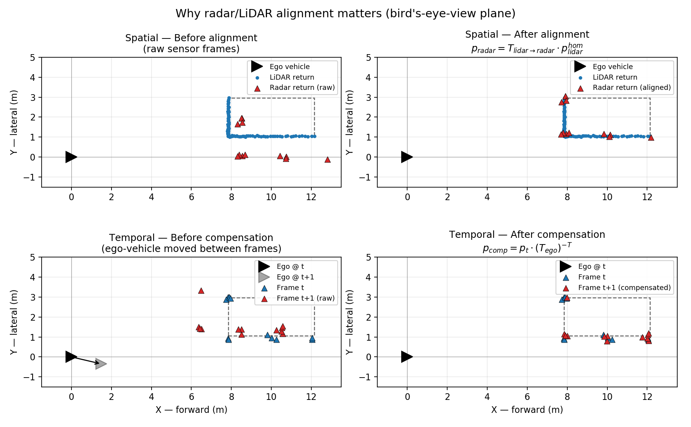

# Introduction

## Radar/LiDAR Data Alignment

Radar and LiDAR are mounted at different positions/orientations on the vehicle and
are sampled while the ego-vehicle is moving, so raw point clouds from the two
sensors and from consecutive frames do not share a common reference frame. Two
corrections are applied before fusion (see `dataloader/track_vod_3d.py`):

**1. Extrinsic (spatial) alignment.** Points are converted to homogeneous
coordinates and mapped between sensors with the calibrated rigid transform
(`homogeneous_transformation`, `external/vod/frame/transformations.py`):

$$
\mathbf{p}_{radar} = T_{lidar \rightarrow radar} \cdot \mathbf{p}_{lidar}^{hom}
$$

**2. Temporal (ego-motion) alignment.** Radar returns are sparse (a VoD frame
typically yields on the order of only a few dozen points per object), so the
pipeline compensates and accumulates radar sweeps from consecutive frames into
one common frame instead of relying on a single sweep. Each frame $t$ has its
own pose chain $T_{odom \rightarrow camera}(t)$ and $T_{camera \rightarrow radar}(t)$
(these are the extrinsics VoD's calibration actually exposes per frame, via
`FrameTransformMatrix`), so they are first composed per frame:

$$
T_{odom \rightarrow radar}(t) = T_{odom \rightarrow camera}(t) \cdot T_{camera \rightarrow radar}(t)
$$

The relative ego-motion between frame $t$ and $t{+}1$ is then the pose change
expressed in the radar frame — how far and in which direction the sensor rig
itself translated/rotated while the world stood still:

$$
T_{ego} = \big(T_{odom \rightarrow radar}(t)\big)^{-1} \cdot T_{odom \rightarrow radar}(t+1)
$$

$T_{ego}$ is a rigid-body (SE(3)) transform, i.e. it carries both the
translation and the rotation of the ego-vehicle between the two timestamps —
this matters because on turns a pure translation offset would under-correct
points far from the sensor. The earlier point cloud is finally re-expressed
in the later frame by inverting this motion out of it:

$$
\mathbf{p}_{comp} = \mathbf{p}_{t} \cdot \big(T_{ego}\big)^{-T}
$$

so that $\mathbf{p}_{comp}$ and the frame-$(t{+}1)$ points describe the scene
from the *same* ego pose and can be safely stacked into one denser radar point
cloud, or diffed frame-to-frame to read off an object's true motion.

### Importance of Alignment

Both corrections operate on the same ground (BEV) plane used throughout this
project, and both are necessary for the multimodal fusion and tracking to
associate points/detections correctly:

- If $T_{lidar \rightarrow radar}$ (Eq. 1) is **not** applied, radar and LiDAR
  points that hit the same physical object land in different $(x, y)$
  locations of the plane purely because of the fixed sensor-mounting offset —
  the fusion backbone would then be matching geometry from two different
  places, not two views of the same place.
- If $T_{ego}$ (Eq. 2) is **not** applied, a *static* object appears to move
  between consecutive frames simply because the ego-vehicle moved — every
  point in the scene, not just the tracked object, inherits the same apparent
  drift. Two things break as a consequence:
  - **Radar accumulation.** Stacking raw (uncompensated) sweeps to densify the
    sparse radar point cloud would smear a single object's returns across
    several offset positions instead of reinforcing one footprint.
  - **Tracking/motion cues.** The tracker's frame-to-frame displacement signal
    would mix real object motion with ego-vehicle motion, biasing velocity
    estimates and increasing ID switches — a parked car would look like it is
    moving toward or away from the ego-vehicle.

The figure below renders this in a style closer to real automotive sensor
output rather than an idealized outline: the LiDAR trace only covers the two
vehicle faces actually visible to (facing) the ego sensor, denser near the
closest corner as real beam sampling would produce, while the radar is a
handful of sparse returns clustered on strong reflectors (corners / wheel
arches) — the dashed rectangle is the ground-truth 3D box shown only for
reference. Left column is the raw, unaligned points; right column is the
result of applying Eq. 1 (top row) and Eq. 2 (bottom row). Without alignment
the two point sets describe what looks like two different objects; after
alignment they collapse onto the same footprint.

## BEV 3D-to-2D Projection

Point clouds are rasterized to a top-down (bird's-eye-view) image for
inference visualization (see `birds_eye_point_cloud`,
`external/gnd/module/lidar_projection.py`, used from `utils/visualization_eval.py`).
For a resolution $res$ (meters/pixel) and a point $(x, y, z)$:

$$
\text{col} = \left\lfloor \frac{-y}{res} \right\rfloor - \left\lfloor \frac{side_{min}}{res} \right\rfloor
\qquad
\text{row} = \left\lfloor \frac{x}{res} \right\rfloor - \left\lfloor \frac{fwd_{min}}{res} \right\rfloor
$$

$$
\text{pixel} = 255 \cdot \frac{z_{max} - \text{clip}(z,\, z_{min},\, z_{max})}{z_{max} - z_{min}}
$$

**Why:** this turns an unordered 3D point cloud into a dense, ground-plane-indexed
2D image (height-encoded), which is inexpensive to render and lets predicted
boxes/tracks be overlaid and visually compared against ground truth per frame.

## Caso de estudio

## Datasets relacionado

## Tracking vs Re identificacion

TODO: Write a project introduction here.
