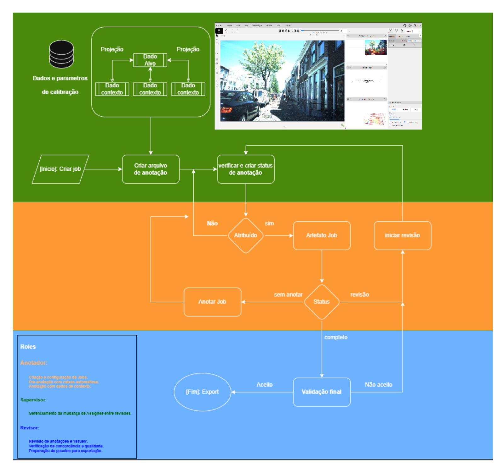

# Case study: annotating maritime surveillance radar

A field deployment applied the annotation protocol of this repository to a
**real-aperture maritime radar** in B-scope, together with several optical
cameras. This page documents the method — the annotation workflow, the
difficulties the annotators reported, and the detection results.

!!! note "What this page does not contain"
    No radar frames, camera frames or any other imagery from the deployment are
    shown, and neither are its location, dates or sensor identifiers. The figure
    below illustrates the workflow using **View of Delft**, a public dataset,
    not the deployment data. Only method, aggregate statistics and results are
    reported.

## Why maritime radar is hard to annotate

Radar describes a target through the backscattering of electromagnetic pulses,
so a B-scope frame is an **azimuth × range** representation. Two consequences
drive everything else on this page:

- **It is not a top-down view of the terrain.** Unlike the Plan Position
  Indicator of a bridge console, a B-scope frame has no direct spatial
  correspondence with the coastline an annotator would recognise. Shapes,
  intensities and sizes do not match what a human expects a vessel to look like.
- **The representation moves with the acquisition settings.** Changing range or
  gain changes the backscattering itself, so the same scene renders differently
  and previously learned visual cues stop applying.

On top of that, a radar frame carries physical phenomena that are not targets at
all: atmospheric fronts, wakes generated by vessel motion, rain clutter and
radiometric noise.

## Annotation workflow

The protocol annotates **one modality only** and keeps the others as context,
so the annotation can later be reprojected onto the remaining sensors. The
workflow, its three roles and the review loop are the ones defined in the thesis:

*Workflow of the annotation process in CVAT. The screenshot inside the diagram
uses View of Delft — it is not deployment data.*

The lanes map to the three roles: the **annotator** creates and configures jobs,
pre-annotates and annotates with context data; the **supervisor** manages
assignee changes between reviews; the **reviewer** checks annotations and
issues, verifies agreement and quality, and prepares the export packages. A job
only reaches export after a final validation, and anything rejected returns to
the review loop.

### Pairing radar with optical context

Not every radar frame has an optical counterpart, so candidates were matched by
timestamp in two passes:

1. **Direct window match** — an optical frame counts as a candidate when its
   timestamp falls inside the radar acquisition window. This produced **821
   matches against 3043 non-matches**.
2. **Rotation-tolerant match** — assuming the radar takes at most **3 seconds**
   to complete a rotation, residual frames within that margin can still describe
   useful behaviour. This raised coverage to **1203 radar images** with at least
   one candidate.

The matched context is written next to each radar frame in the layout CVAT
expects, so the annotator opens a single workspace already enriched with the
other views plus the simulated field of view of each camera.

### Rules the protocol converged on

The rules were refined progressively as annotation advanced:

- **Annotate on the radar frame only**, never on the context image.
- **Confirm each instance visually** in both the radar data and the context
  image, to discard acquisition noise.
- **Context images confirm existence in time**, nothing more — they establish
  that an instance was present in the area, not where its box goes.
- **Terrain masks restrict the annotated region** to the water, so effort is not
  spent on areas that cannot contain a vessel.

## What the annotators reported

The difficulties below come from the annotation guide written during the
campaign, and they explain most of the detector's later behaviour.

**Granular noise that mimics small targets.** Parts of the sea showed granular
noise concentrated in specific regions. Its continuity and granularity over a
large portion of the frame made clear it was not a moving vessel, but without
meteorological data for the timestamp it could not be confirmed whether it was
rain clutter or radiometric noise.

**Vessels interacting with terrain.** Targets near the coast or a bridge caused
losses of sequential continuity and genuine doubt about whether a shape was a
vessel or generated terrain, because the terrain mask did not always cover the
land completely.

**Static and very small instances.** Motion was a primary cue: shapes with a
stronger backscattering component and visible displacement were far easier to
call. Static objects raised doubt about whether they were relief or an artefact,
and small instances returned a weaker pulse, appearing as dimmer areas that
blend into noise.

**Reflections and thermal artefacts** in the auxiliary infrared views —
bright patches that do not correspond to vessels, and image quality varying with
distance, thermal intensity, atmospheric pollution and camera stability.

## Dataset composition

| Property | Value |
|---|---|
| Radar frames annotated | 3804 |
| Frames with optical context | subset only (1203 with a candidate) |
| Split | 70% train / 20% validation / 10% test |
| Split criterion | complete sequences, ordered by timestamp |
| Bounding box sizes | 10×15 to 64×80 px |

Splitting by **complete sequences** rather than by frame keeps the evaluation
honest: the model is measured on similar scenes at different instants, instead
of on frames neighbouring those it trained on. The size range places the task
squarely in **small object detection** — that single fact drove the choice of
architecture.

## Detection method

YOLOv8 was chosen for its handling of multi-scale targets and its behaviour
under transfer learning from COCO.

| Hyperparameter | Value |
|---|---|
| Architecture | YOLOv8 X, L and S |
| Image scale | 1920 × 1088 |
| Optimiser | SGD, learning rate 0.01 |
| Batch size | 22 |
| Loss | GIoU |
| Pre-training | COCO |
| Epochs | 65 |

**Partial freezing.** The early backbone layers were frozen — they capture edges
and textures, which transfer across domains — while the upper neck layers stayed
trainable, in particular P2 and the last four. Those are the ones that perform
multi-scale fusion and build the contextual representation specific to the size
and pattern of radar targets. The model therefore keeps its generic knowledge of
natural images while adapting to the low resolution and characteristic noise of
radar.

## Results

The three architectures did not differ significantly from one another: with a
dataset this small, this self-similar and this dominated by small instances,
capacity was not the limiting factor.

**Where the model works.** Medium-sized targets are detected reliably, including
a vessel crossing the scene together with the wake of its own motion, and
vessels sitting still behind a large structure presumed to be a bridge.

**Where it fails.** Detection degrades sharply below roughly **25×32 pixels**.
Two failure modes recur:

- **Terrain proximity.** Targets partially occluded by, or very close to, the
  terrain mask are missed — the model associates bright regions near land with
  background.
- **Small-target switching.** Across consecutive frames, small objects flip
  between detected and missed. This traces back to the noise level and to
  annotation inconsistency on exactly those instances: where the annotator
  hesitated, the model is unstable.

**The most valuable property** is what the model does *not* do: it is robust
against false positives. It does not fire on terrain or on the inherently
brighter points that come from noise. For a surveillance task, a detector that
stays silent rather than crying wolf is the more useful failure mode.

## What this says about the annotation protocol

The detector's weakest region — instances under 25×32 px — is precisely where
the annotators reported the most doubt. The two are the same problem seen from
two ends: when noise and target become visually indistinguishable, neither the
human nor the model can separate them, and the inconsistency introduced during
annotation propagates into the training signal as a switching effect.

This is the practical argument for the protocol's insistence on **temporal
confirmation through context images**: motion, not appearance, is what makes a
small maritime target identifiable in B-scope radar.
