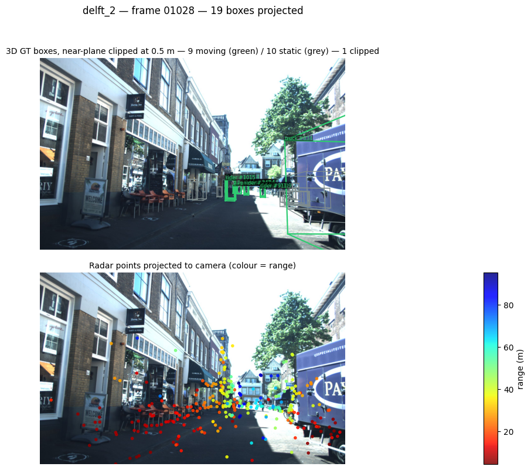
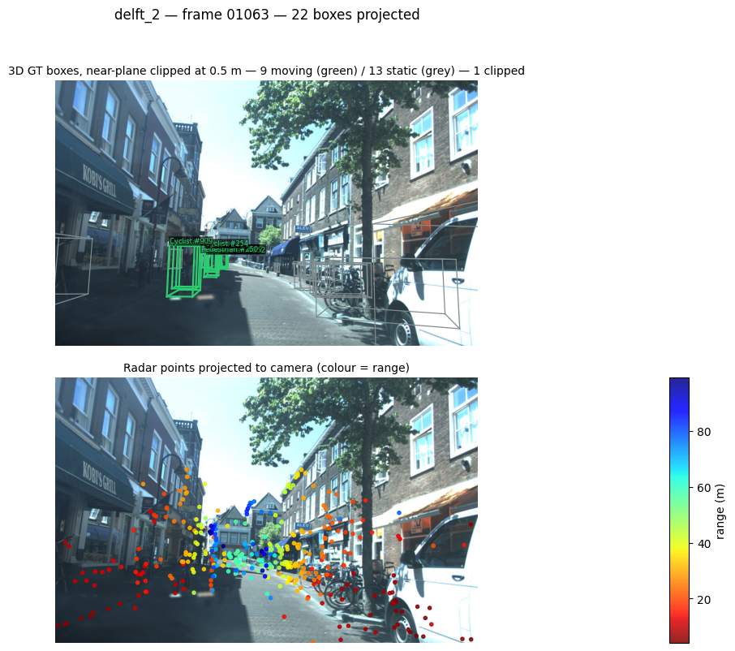
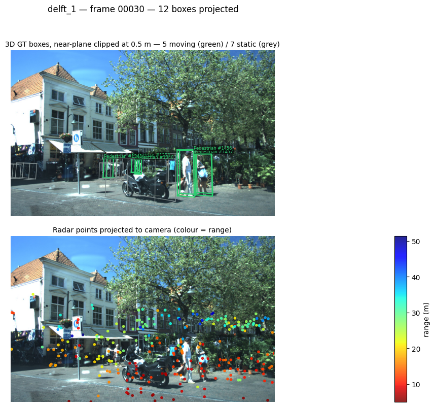

# 3D → 2D reprojection

How a 3D ground-truth box becomes a wireframe on the camera image, and the
failure mode that appears when an object gets very close to the camera.

- [The method](#the-method)
- [The equations](#the-equations)
- [Running the check](#running-the-check)
- [A common reprojection error](#a-common-reprojection-error)
- [The fix — `check_projection_adjusted.py`](#the-fix--check_projection_adjustedpy)
- [A third failure: boxes outside the camera field of view](#a-third-failure-boxes-outside-the-camera-field-of-view)
- [Why this justifies manually annotated 2D boxes](#why-this-justifies-manually-annotated-2d-boxes)

## The method

The projection is the **pinhole camera model** — a rigid-body (SE(3)) transform
into the camera frame, followed by a **perspective projection** through the
camera projection matrix and a **perspective division** (dehomogenisation).

In KITTI/VoD terms this is the standard `P2` projection: a 3×4 matrix that folds
the camera intrinsics $K$ together with the stereo-rectification offset, applied
to homogeneous coordinates. VoD's devkit implements it in
`get_2d_label_corners` (`external/vod/visualization/helpers.py`); the same math
is reimplemented in `examples/dataloader/check_projection.py` so the track id
and moving flag survive (the devkit sorts boxes by range and drops both).

## The equations

**1. Box corners in the object frame.** For a box of size $(l, w, h)$ the eight
corners are, with the origin at the bottom face:

$$
\mathbf{c}_i = \left(\pm\tfrac{l}{2},\; \pm\tfrac{w}{2},\; \{0, h\}\right),
\qquad i = 1 \dots 8
$$

**2. Rotate and place.** VoD stores the yaw as $r_y$ with a $\pi/2$ offset
relative to the box frame, so it is undone before rotating about the vertical
axis, and the centre is expressed in the LiDAR frame:

$$
R_z(\theta) = \begin{bmatrix}\cos\theta & -\sin\theta & 0\\ \sin\theta & \cos\theta & 0\\ 0 & 0 & 1\end{bmatrix},
\qquad \theta = -\left(r_y + \tfrac{\pi}{2}\right)
$$

$$
\mathbf{t} = T_{lidar \leftarrow camera}\,[x,\,y,\,z,\,1]^{\top},
\qquad
\mathbf{p}_i = R_z(\theta)\,\mathbf{c}_i + \mathbf{t}_{1:3}
$$

**3. Back to the camera frame, then project.** With $P$ the 3×4 camera
projection matrix:

$$
\tilde{\mathbf{p}}_i = T_{camera \leftarrow lidar}\,[\mathbf{p}_i,\,1]^{\top},
\qquad
\begin{bmatrix} \tilde{u} \\ \tilde{v} \\ \tilde{w} \end{bmatrix} = P\,\tilde{\mathbf{p}}_i
$$

**4. Perspective division.** This is the step that matters below:

$$
\boxed{\;u = \frac{\tilde{u}}{\tilde{w}}, \qquad v = \frac{\tilde{v}}{\tilde{w}}, \qquad \tilde{w} = Z_c\;}
$$

$Z_c$ is the point's depth along the optical axis. For a pinhole camera this
expands to the familiar form

$$
u = f_x\frac{X_c}{Z_c} + c_x, \qquad v = f_y\frac{Y_c}{Z_c} + c_y
$$

so pixel coordinates are inversely proportional to depth.

## Running the check

Inside the container:

```bash
python examples/dataloader/check_projection.py --split both
python examples/dataloader/check_projection.py --split val --limit 20
python examples/dataloader/check_projection.py --split train --stride 10
```

From the host:

```bash
docker run --rm --gpus all \
  -v "$PWD":/project \
  -v /path/to/view_of_delft_PUBLIC:/project/view_of_delft_PUBLIC:ro \
  -w /project will/tracker_multimodal_mira \
  conda run -n mira python examples/dataloader/check_projection.py --split both
```

Figures land in `examples/dataloader/check_projection/<split>/` (git-ignored).
The dataset path comes from `--root` or `$VOD_ROOT`.

### A correctly projected frame


*`delft_2`, frame 01004. Every wireframe sits on its object. The nearest box
corner is 10.5 m away, so the projection is well conditioned: the largest pixel
coordinate is 1,946 px against a 1,936 px canvas.*

## A common reprojection error

When an object comes very close to the camera, some of its corners fall almost
**on the image plane** ($Z_c \to 0$). Perspective division then divides by a
near-zero number and the corner is thrown thousands of pixels off-canvas, so the
wireframe explodes into diverging lines. Because matplotlib autoscales the axes
to fit whatever was drawn, the photo itself gets squeezed into a thumbnail.


*`delft_2`, frames 01027, 01028 and 01063 — a truck and a car passing within a
few metres of the sensor.*

### Why, with numbers

Measured on these frames, with $f_x = 1495.47$ px and $c_x = 961.27$ px:

| Frame | Object | Nearest corner $Z_c$ | max $\|u,v\|$ | vs 1936 px canvas |
|---|---|---:|---:|---:|
| 01004 | bicycle #835 | 10.521 m | 1,946 px | 1× |
| 01027 | truck #834 | **0.193 m** | 25,323 px | **13×** |
| 01063 | Car #908 | **0.064 m** | 53,438 px | **28×** |

Taking frame 01063: a corner at $X_c \approx 2.2$ m, $Z_c = 0.064$ m gives

$$
u = 1495.47 \cdot \frac{2.2}{0.064} + 961.27 \;\approx\; 52{,}400 \text{ px}
$$

The same corner at a normal 10 m depth would land at

$$
u = 1495.47 \cdot \frac{2.2}{10} + 961.27 \;\approx\; 1{,}290 \text{ px}
$$

i.e. comfortably inside the image. Depth shrank by ~156×, so the coordinate grew
by ~156×. Nothing is wrong with the calibration — this is the projective
geometry behaving exactly as defined; the model simply has a singularity at
$Z_c = 0$, where a point on the image plane maps to infinity.

### Consequences

The frames are **not** corrupt and the labels are **not** wrong: only the
*rendering* degrades, and only for objects within a couple of metres. Anything
consuming boxes in 3D (the tracker, the metrics) is unaffected — the failure is
confined to the 2D visualisation.

`check_projection.py` drops edges whose endpoints fall behind or on the image
plane ($Z_c \le 0.1$ m), which is why frame 01063 renders part of its box. That
threshold is not enough on its own: frame 01027's nearest corner sits at
0.193 m, passing the test while still projecting 13 canvas-widths away.

## The fix — `check_projection_adjusted.py`

A separate script renders the same panels with the artefact removed, by
constraining the projection to the image canvas. Two corrections, in this order:

**1. Near-plane clipping, in 3D, before the division.** Each edge is intersected
with the plane $Z_c = \text{NEAR}$ (default 0.5 m) and only the visible part is
kept:

$$
\mathbf{P}(t) = \mathbf{P}_1 + t\,(\mathbf{P}_2 - \mathbf{P}_1),
\qquad
t = \frac{\text{NEAR} - z_1}{z_2 - z_1}
$$

Doing this **before** the perspective division is what makes it correct.
Clamping pixel coordinates afterwards would bend edges towards the wrong place,
because the projection of a point behind the camera is not a point in front of
it — the mapping flips sign through the singularity. This is exactly what a
rasteriser's near plane does.

**2. Canvas clamp.** Axes limits are pinned to the image extent
(`ax.set_xlim(0, W)`, `ax.set_ylim(H, 0)`) and artists drawn with
`clip_on=True`, so a surviving stray coordinate can no longer autoscale the
photo out of view.

The same three frames, clipped. Compare each with its raw counterpart above: the
photo keeps its full size, boxes are drawn only where they are actually visible,
and the title reports how many were clipped.






```bash
python examples/dataloader/check_projection_adjusted.py --split both
python examples/dataloader/check_projection_adjusted.py --split val --limit 20
python examples/dataloader/check_projection_adjusted.py --split train --near 1.0
```

`--near` sets the clipping plane in metres. Output goes to
`examples/dataloader/check_projection_adjusted/<split>/`, git-ignored like the
others. Both scripts are kept: `check_projection.py` shows the raw projection
(useful for spotting calibration problems, since nothing is hidden), while this
one is the readable version.

## A third failure: boxes outside the camera field of view

Clipping fixes the geometry but cannot fix a coverage mismatch. **VoD annotates
from a 360° LiDAR while the camera is forward-facing**, so an object can carry a
perfectly valid 3D box and still project entirely off-canvas.



*`delft_1`, frame 00030. `bicycle #1334` sits 18.5 m away with a healthy depth —
no near-plane problem at all — yet none of its eight corners lands inside the
image, so it simply does not appear. Nothing is wrong: the camera cannot see it.*

## Why this justifies manually annotated 2D boxes

Reprojecting the 3D boxes is the obvious way to obtain 2D labels for free. It is
not sufficient. Measured over **18,389 real-class instances in front of the
camera** (every 5th frame of train + val):

| Outcome of reprojection | Instances | Share |
|---|---:|---:|
| Geometrically intact on the canvas | 16,061 | **87.3%** |
| Some corners outside the canvas (truncated) | 2,234 | **12.1%** |
| Corners clipped by the near plane | 71 | 0.4% |
| No corner inside the canvas at all | 23 | 0.1% |

So **roughly one instance in eight** yields a projected box that does not land
fully on the image, through three distinct mechanisms — perspective blow-up at
close range, truncation at the image border, and objects outside the camera
frustum. For those the reprojected box is not a usable 2D bounding box.

Two further reasons apply even to the 87.3% that project cleanly:

* **Amodal vs modal.** A projected 3D box is *amodal* — it covers the whole
  object, including the parts hidden behind other objects. A 2D detection label
  is normally *modal*, covering only what is visible. Under occlusion the two
  disagree by construction, and no amount of clipping reconciles them.
* **Axis-aligned hull overestimates.** A 2D box is an axis-aligned rectangle, so
  deriving one means taking $\min/\max$ over the eight projected corners. For a
  rotated 3D box that hull is strictly larger than the object's true image
  footprint, and the error grows with yaw and proximity.

Reprojection is therefore useful as a *sanity check on the calibration* — which
is exactly what these scripts do — but not as a source of 2D ground truth.
Measuring the reprojection error, and having a reliable 2D reference at all,
requires boxes annotated directly in the image, which is why this project ships
[manually annotated 2D labels](https://doi.org/10.5281/zenodo.18933010) rather
than deriving them from the 3D ones.
