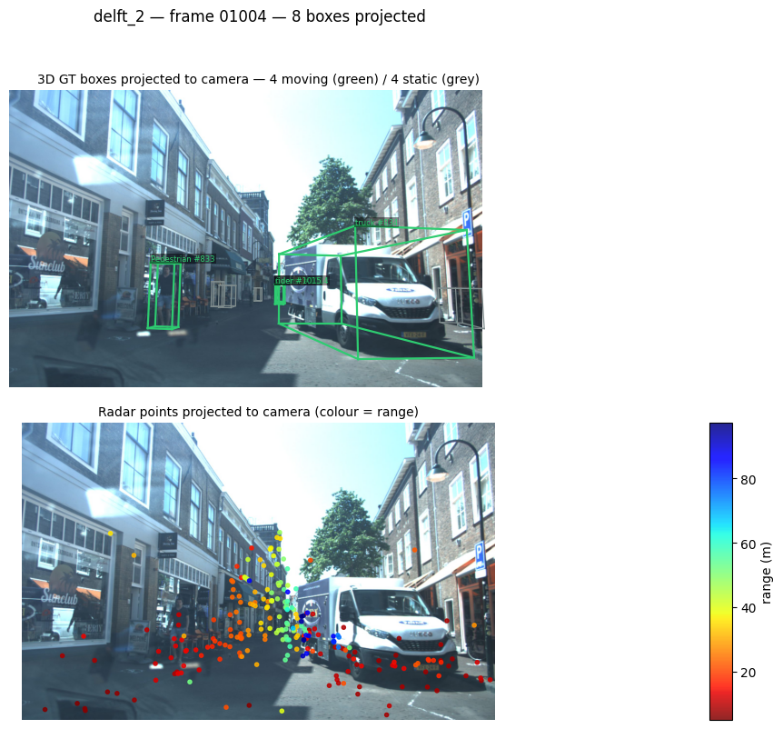
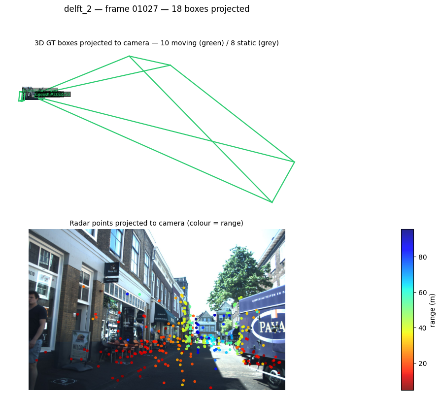
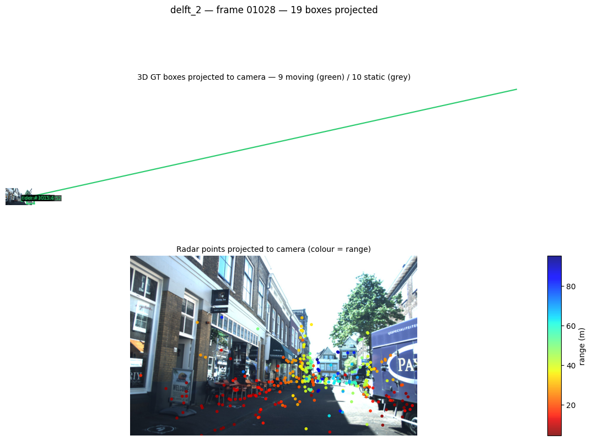
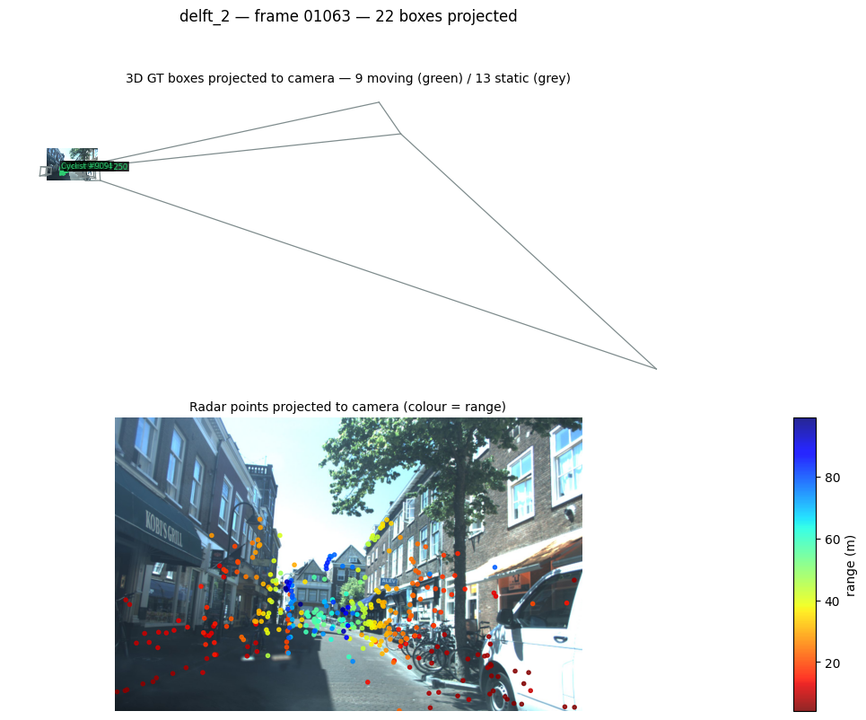

# 3D → 2D reprojection

How a 3D ground-truth box becomes a wireframe on the camera image, and the
failure mode that appears when an object gets very close to the camera.

- [The method](#the-method)
- [The equations](#the-equations)
- [Running the check](#running-the-check)
- [A common reprojection error](#a-common-reprojection-error)

## The method

The projection is the **pinhole camera model** — a rigid-body (SE(3)) transform
into the camera frame, followed by a **perspective projection** through the
camera projection matrix and a **perspective division** (dehomogenisation).

In KITTI/VoD terms this is the standard `P2` projection: a 3×4 matrix that folds
the camera intrinsics $K$ together with the stereo-rectification offset, applied
to homogeneous coordinates. VoD's devkit implements it in
`get_2d_label_corners` (`external/vod/visualization/helpers.py`); the same math
is reimplemented in `examples/dataloader/check_projection.py` so the track id
and moving flag survive (the devkit sorts boxes by range and drops both).

## The equations

**1. Box corners in the object frame.** For a box of size $(l, w, h)$ the eight
corners are, with the origin at the bottom face:

$$
\mathbf{c}_i = \left(\pm\tfrac{l}{2},\; \pm\tfrac{w}{2},\; \{0, h\}\right),
\qquad i = 1 \dots 8
$$

**2. Rotate and place.** VoD stores the yaw as $r_y$ with a $\pi/2$ offset
relative to the box frame, so it is undone before rotating about the vertical
axis, and the centre is expressed in the LiDAR frame:

$$
R_z(\theta) = \begin{bmatrix}\cos\theta & -\sin\theta & 0\\ \sin\theta & \cos\theta & 0\\ 0 & 0 & 1\end{bmatrix},
\qquad \theta = -\left(r_y + \tfrac{\pi}{2}\right)
$$

$$
\mathbf{t} = T_{lidar \leftarrow camera}\,[x,\,y,\,z,\,1]^{\top},
\qquad
\mathbf{p}_i = R_z(\theta)\,\mathbf{c}_i + \mathbf{t}_{1:3}
$$

**3. Back to the camera frame, then project.** With $P$ the 3×4 camera
projection matrix:

$$
\tilde{\mathbf{p}}_i = T_{camera \leftarrow lidar}\,[\mathbf{p}_i,\,1]^{\top},
\qquad
\begin{bmatrix} \tilde{u} \\ \tilde{v} \\ \tilde{w} \end{bmatrix} = P\,\tilde{\mathbf{p}}_i
$$

**4. Perspective division.** This is the step that matters below:

$$
\boxed{\;u = \frac{\tilde{u}}{\tilde{w}}, \qquad v = \frac{\tilde{v}}{\tilde{w}}, \qquad \tilde{w} = Z_c\;}
$$

$Z_c$ is the point's depth along the optical axis. For a pinhole camera this
expands to the familiar form

$$
u = f_x\frac{X_c}{Z_c} + c_x, \qquad v = f_y\frac{Y_c}{Z_c} + c_y
$$

so pixel coordinates are inversely proportional to depth.

## Running the check

Inside the container:

```bash
python examples/dataloader/check_projection.py --split both
python examples/dataloader/check_projection.py --split val --limit 20
python examples/dataloader/check_projection.py --split train --stride 10
```

From the host:

```bash
docker run --rm --gpus all \
  -v "$PWD":/project \
  -v /path/to/view_of_delft_PUBLIC:/project/view_of_delft_PUBLIC:ro \
  -w /project will/tracker_multimodal_mira \
  conda run -n mira python examples/dataloader/check_projection.py --split both
```

Figures land in `examples/dataloader/check_projection/<split>/` (git-ignored).
The dataset path comes from `--root` or `$VOD_ROOT`.

### A correctly projected frame



*`delft_2`, frame 01004. Every wireframe sits on its object. The nearest box
corner is 10.5 m away, so the projection is well conditioned: the largest pixel
coordinate is 1,946 px against a 1,936 px canvas.*

## A common reprojection error

When an object comes very close to the camera, some of its corners fall almost
**on the image plane** ($Z_c \to 0$). Perspective division then divides by a
near-zero number and the corner is thrown thousands of pixels off-canvas, so the
wireframe explodes into diverging lines. Because matplotlib autoscales the axes
to fit whatever was drawn, the photo itself gets squeezed into a thumbnail.







*`delft_2`, frames 01027, 01028 and 01063 — a truck and a car passing within a
few metres of the sensor.*

### Why, with numbers

Measured on these frames, with $f_x = 1495.47$ px and $c_x = 961.27$ px:

| Frame | Object | Nearest corner $Z_c$ | max $\|u,v\|$ | vs 1936 px canvas |
|---|---|---:|---:|---:|
| 01004 | bicycle #835 | 10.521 m | 1,946 px | 1× |
| 01027 | truck #834 | **0.193 m** | 25,323 px | **13×** |
| 01063 | Car #908 | **0.064 m** | 53,438 px | **28×** |

Taking frame 01063: a corner at $X_c \approx 2.2$ m, $Z_c = 0.064$ m gives

$$
u = 1495.47 \cdot \frac{2.2}{0.064} + 961.27 \;\approx\; 52{,}400 \text{ px}
$$

The same corner at a normal 10 m depth would land at

$$
u = 1495.47 \cdot \frac{2.2}{10} + 961.27 \;\approx\; 1{,}290 \text{ px}
$$

i.e. comfortably inside the image. Depth shrank by ~156×, so the coordinate grew
by ~156×. Nothing is wrong with the calibration — this is the projective
geometry behaving exactly as defined; the model simply has a singularity at
$Z_c = 0$, where a point on the image plane maps to infinity.

### Consequences and mitigation

The frames are **not** corrupt and the labels are **not** wrong: only the
*rendering* degrades, and only for objects within a couple of metres. Anything
consuming boxes in 3D (the tracker, the metrics) is unaffected — the failure is
confined to the 2D visualisation.

`check_projection.py` already drops edges whose endpoints fall behind or on the
image plane ($Z_c \le 0.1$ m), which is why frame 01063 renders only part of its
box. That threshold is not enough on its own: frame 01027's nearest corner sits
at 0.193 m, passing the test while still projecting 13 canvas-widths away. Two
complementary guards remove the artefact entirely:

* **raise the near-plane cutoff**, discarding corners closer than roughly 0.5–1 m
  (nothing useful is visible that close anyway);
* **clamp the axes after drawing** — `ax.set_xlim(0, W)` and `ax.set_ylim(H, 0)`
  — so a stray coordinate can no longer autoscale the photo out of view.

Proper near-plane **clipping** (intersecting each edge with the $Z_c = \epsilon$
plane and drawing only the visible segment) is the textbook fix and is what a
rasteriser does; the two guards above are the cheap approximation.
