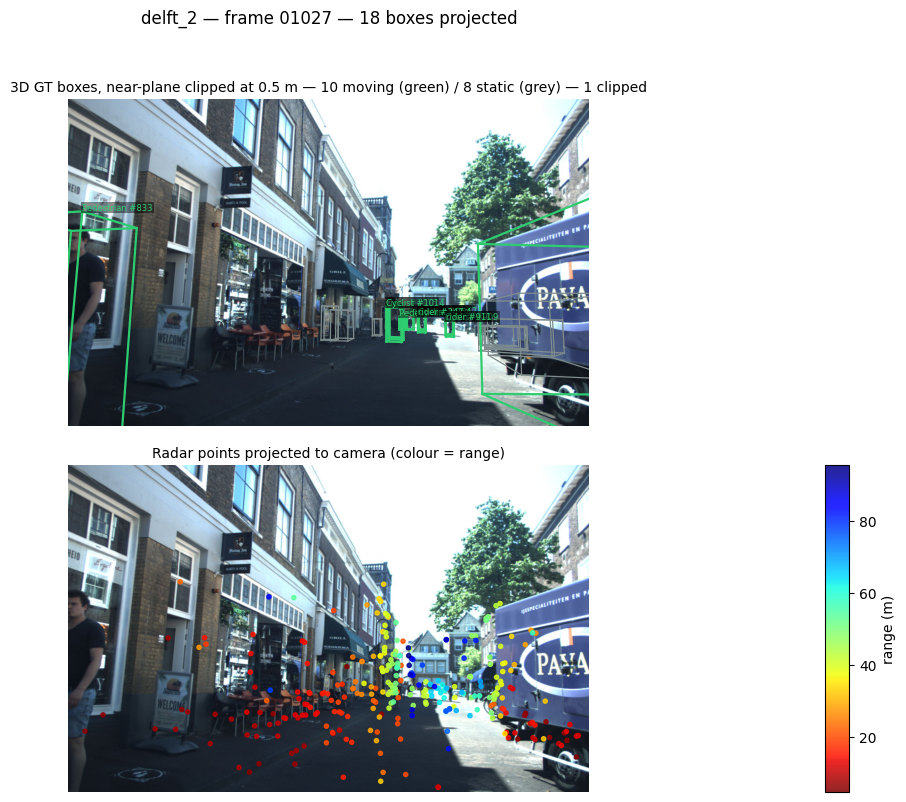

# Dataloader sanity checks

Two scripts render one figure per frame across the train and validation splits,
so the geometry the network consumes can be inspected before training.

| Script | Verifies | Output |
|---|---|---|
| `check_dataloader.py` | BEV geometry — radar↔LiDAR extrinsic and ego-motion compensation | `check/` |
| `check_projection.py` | camera projection chain — raw, nothing hidden | `check_projection/` |
| `check_projection_adjusted.py` | same, with near-plane clipping so close objects stay on-canvas | `check_projection_adjusted/` |

---

## `check_dataloader.py` — BEV geometry


### Panels

| Panel | What it verifies |
|---|---|
| Radar / LiDAR alignment (BEV) | the extrinsic transform — both modalities must land on the same structures; a constant offset means the calibration is wrong |
| Ego-motion compensation (BEV) | `T_ego` — static structure must collapse onto itself between raw and compensated sweep; residual drift means the pose chain is wrong |
| LiDAR BEV height map | the top-down rasterisation used downstream |
| Camera | RGB reference for the same frame |

Ground-truth **moving** boxes are overlaid on the BEV panels.

## Running

Inside the container:

```bash
python examples/dataloader/check_dataloader.py --split both        # ~6400 figures
python examples/dataloader/check_dataloader.py --split val --limit 20
python examples/dataloader/check_dataloader.py --split train --stride 10
```

From the host:

```bash
docker run --rm --gpus all \
  -v "$PWD":/project \
  -v /path/to/view_of_delft_PUBLIC:/project/view_of_delft_PUBLIC:ro \
  -w /project will/tracker_multimodal_mira \
  conda run -n mira python examples/dataloader/check_dataloader.py --split both
```

The dataset location comes from `--root` or `$VOD_ROOT`, defaulting to
`/project/view_of_delft_PUBLIC`.

## Output

Figures land in `check/<split>/` (git-ignored). The full run is ~6400 PNGs and a
few hundred MB, so regenerate locally rather than committing. Use `--stride` or
`--limit` for a quick look.

Frames whose neighbours (`t±1`) are missing are skipped by the dataset itself —
the loader needs three consecutive frames for ego-motion compensation, so 8 of
the 1296 validation frames are excluded by design.

---

## `check_projection.py` — camera projection

Verifies the other half of the calibration: that a 3D box travels correctly
through box (camera frame) → LiDAR frame → camera frame → image plane.


| Panel | What it verifies |
|---|---|
| 3D boxes on RGB | the full projection chain and rotation convention. Moving objects green with track id, static grey; a wrong calibration makes wireframes drift off the objects |
| Radar points on RGB | the radar→camera extrinsic, coloured by range — a cross-check the BEV panels cannot provide |

The math mirrors the devkit's `get_2d_label_corners`, extended to carry the track
id and moving flag through (the devkit sorts by range and drops both fields).
Full derivation and a known failure mode — objects within a couple of metres of
the camera blow up under perspective division — are in
[docs/pages/reprojection.md](../../docs/pages/reprojection.md).

```bash
python examples/dataloader/check_projection.py --split both
python examples/dataloader/check_projection.py --split val --limit 20
```

Unlike `check_dataloader.py`, this one reads frames directly and does not need
the `t±1` neighbours, so it covers every annotated frame in both splits.

---

## `check_projection_adjusted.py` — projection constrained to the canvas

Same panels, with the reprojection blow-up removed. Objects passing within a
couple of metres of the camera have corners at near-zero depth; perspective
division throws them tens of thousands of pixels off-canvas and matplotlib then
squeezes the photo into a thumbnail.



Two corrections:

1. **Near-plane clipping in 3D, before the division** — each edge is intersected
   with `Z_c = NEAR` (default 0.5 m) and only the visible part drawn. Clipping
   before projecting is what makes it correct; clamping pixels afterwards would
   bend edges to the wrong place.
2. **Canvas clamp** — axes pinned to the image extent with `clip_on=True`.

```bash
python examples/dataloader/check_projection_adjusted.py --split both
python examples/dataloader/check_projection_adjusted.py --split train --near 1.0
```

Both projection scripts are kept: the raw one hides nothing and is the better
tool for spotting calibration problems, this one is the readable version. Full
derivation in [docs/pages/reprojection.md](../../docs/pages/reprojection.md).
